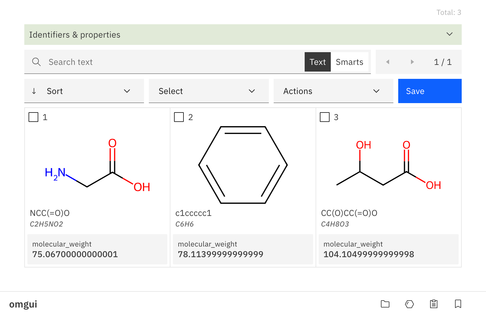
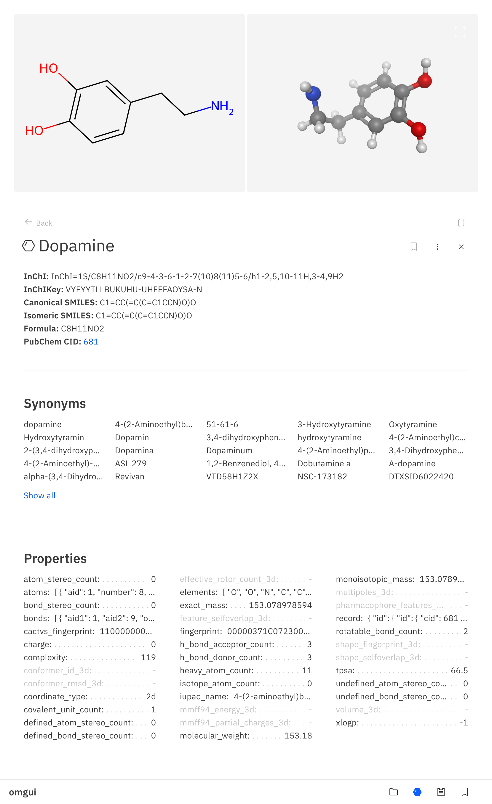

# OMGUI

### _Open-source Molecular Graphical User Interface_

[](https://pypi.org/project/omgui/)
[](https://pypi.org/project/omgui/)
[](https://opensource.org/licenses/MIT)
[](https://jupyter.org/)

OMGUI makes it dead-simple to visualize and triage your molecule results in Python.  
It supports small molecules as well as macromolecules like proteins, plus it does a [whole lot more](docs/functionality.md).

Run it from a Jupyter Notebook or any python script.

```shell
# pip install omgui # To be published
pip install git+https://github.com/themoenen/omgui@gui_merge
```

<br>

> [!WARNING]  
> OMGUI is in development. Not all described functionality is implemented yet.

<br>

## Quick Start

### Inspect a Set of Molecules

```python
import omgui

omgui.show_molset(["C(C(=O)O)N", "C1=CC=CC=C1", "CC(CC(=O)O)O"])
```

<kbd></kbd>

<br>

### Inspect a Single Molecule

```python
omgui.show_mol('dopamine')
```

<kbd></kbd>

===

To discover what else **omgui** can do for you, jump to [Functioality](docs/functionality.md).

<!-- ```shell
yes | plotly_get_cxrome
``` -->

<!-- source ../agenv/bin/activate -->

<!-- python -m test -->
