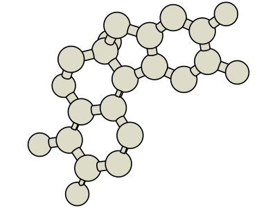
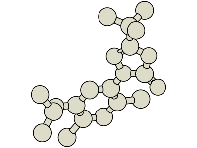

# Molecular Visualization

Visualization server to render 2D and 3D small molecule images on the fly.  
See it in action: [molvis.onrender.com/demo](https://molvis.onrender.com/demo)

<br>

### Install

```
pip install -r requirements.txt
```

```
uvicorn 'main:app' --host=0.0.0.0 --port=8034 --reload
```

<br>

### Optional parameters

| Parameter     | Type   | Default        | Description                                               |
| :------------ | :----- | :------------- | :-------------------------------------------------------- |
| width         | number | None           | Width of the image                                        |
| height        | number | None           | Height of the image                                       |
| png           | bool   | 0              | Render PNG instead of SVG                                 |
| highlight     | str    | None           | SMARTS substructure to highlight                          |
| d3            | bool   | 0              | Render the molecule in 3D                                 |
| d3_rot_x      | number | None           | 3D rotation around the X axis in 60° units                |
| d3_rot_y      | number | None           | 3D rotation around the Y axis in 60° units                |
| d3_rot_z      | number | None           | 3D rotation around the Z axis in 60° units                |
| d3_rot_random | bool   | 0              | Random 3D rotation if not specified                       |
| d3_style      | str    | BALL_AND_STICK | `BALL_AND_STICK` / `SPACE_FILLING` / `TUBE` / `WIREFRAME` |
| d3_look       | str    | CARTOON        | `CARTOON` / `GLOSSY`                                      |

<br>

### Examples

**2D**

-   [molvis.onrender.com/Clc1cc(Cl)c(Cl)c(-c2c(Cl)c(Cl)cc(Cl)c2Cl)c1Cl](<http://molvis.onrender.com/Clc1cc(Cl)c(Cl)c(-c2c(Cl)c(Cl)cc(Cl)c2Cl)c1Cl>)
-   [molvis.onrender.com/CC(C)Oc1cc(-n2nc(C(C)(C)C)oc2=O)c(Cl)cc1Cl](<http://molvis.onrender.com/CC(C)Oc1cc(-n2nc(C(C)(C)C)oc2=O)c(Cl)cc1Cl>)


**3D**

-   [molvis.onrender.com/Clc1cc(Cl)c(Cl)c(-c2c(Cl)c(Cl)cc(Cl)c2Cl)c1Cl&d3=1](<http://molvis.onrender.com/Clc1cc(Cl)c(Cl)c(-c2c(Cl)c(Cl)cc(Cl)c2Cl)c1Cl?d3=1>)
-   [molvis.onrender.com/CC(C)Oc1cc(-n2nc(C(C)(C)C)oc2=O)c(Cl)cc1Cl&d3=1](<http://molvis.onrender.com/CC(C)Oc1cc(-n2nc(C(C)(C)C)oc2=O)c(Cl)cc1Cl?d3=1>)




<br>

### Stack

This library uses [RDKit](https://www.rdkit.org/) to generate the conformers and to render 2D SVGs, and [Cinemol](https://github.com/moltools/CineMol) to render 3D SVGs.

<!-- source ../agenv/bin/activate -->
