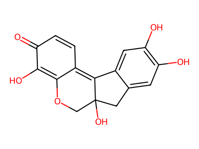
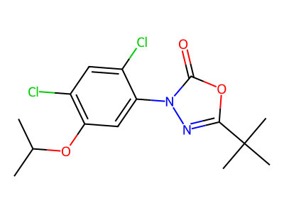

# Molecular Visualisation

Demo visualisation API to experiment with agentic workflows.

It uses [RDKit](https://www.rdkit.org/) to generate the conformers and to render 2D SVGs, and [Cinemol](https://github.com/moltools/CineMol) to render 3D SVGs.

### Launch

```
uvicorn 'main:app' --host=0.0.0.0 --port=8034 --reload
```

### Infer

Add the optional parameter `d3=1` to render the molecule in 3D.

**2D**

-   http://localhost:8034/render-molecule-svg?smiles=Clc1cc(Cl)c(Cl)c(-c2c(Cl)c(Cl)cc(Cl)c2Cl)c1Cl
-   http://localhost:8034/render-molecule-svg?smiles=CC(C)Oc1cc(-n2nc(C(C)(C)C)oc2=O)c(Cl)cc1Cl




**3D**

-   http://localhost:8034/render-molecule-svg?smiles=Clc1cc(Cl)c(Cl)c(-c2c(Cl)c(Cl)cc(Cl)c2Cl)c1Cl&d3=1
-   http://localhost:8034/render-molecule-svg?smiles=CC(C)Oc1cc(-n2nc(C(C)(C)C)oc2=O)c(Cl)cc1Cl&d3=1


