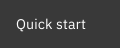

# 😱 OMGUI

### _Open-source Molecular Graphical User Interface_

<!-- [](https://pypi.org/project/omgui/) -->
<!-- [](https://pypi.org/project/omgui/) -->

[](https://opensource.org/licenses/MIT)

<!-- [](https://jupyter.org/) -->

OMGUI makes it dead-simple to visualize and triage your molecule results in Python.  
It supports small molecules as well as macromolecules like proteins, plus it does a [whole lot more](docs/readme.md).

Run it from a **Jupyter Notebook** or any **Python** script.

[](docs/readme.md#omgui---documentation)
[](#quick-start)

> [!IMPORTANT]
> OMGUI is in active development. Not all described functionality is implemented yet.  
> A stable version will be released on PyPI in due time.

<br>

### Installation

More details under [Installation](docs/installation.md).

```shell
pip install git+https://github.com/themoenen/omgui.git@v0.1
```

```python
import omgui

omgui.show_mol('dopamine')
```

<br>

## Quick Start

### Inspect a Set of Molecules

```python
import omgui

omgui.show_mols(["C(C(=O)O)N", "C1=CC=CC=C1", "CC(CC(=O)O)O"])
```

<kbd></kbd>

<br>

### Inspect a Single Molecule

```python
import omgui

omgui.show_mol('dopamine')
```

<kbd></kbd>

<br>

## Troubleshooting

<!-- Blocker port -->
<details>
<summary>Shutting down a blocked port</summary>
<br>

> If the OMGUI server didn't shut down properly and is occupying a port, you can shut it down by visiting:
>
> ```
> http://localhost:8024/shutdown
> ```

</details>

<!-- Inspect config -->
<details>
<summary>Inspecting config</summary>
<br>

> To get an overview of your current configuration including the source of each value, you can run:
>
> ```python
> from omgui import config
>
> config.report()
> ```
>
> For more, visit [config documentation](docs/config.md)

</details>

<details>
<summary>Inspecting context</summary>
<br>

> To see your current context (which sets your workspace and holds your molecule working set), you can run:
>
> ```
> import omgui
>
> omgui.get_context()
> ```

</details>

<br><br>

To discover what else **omgui** can do, [continue here](docs/readme.md).
