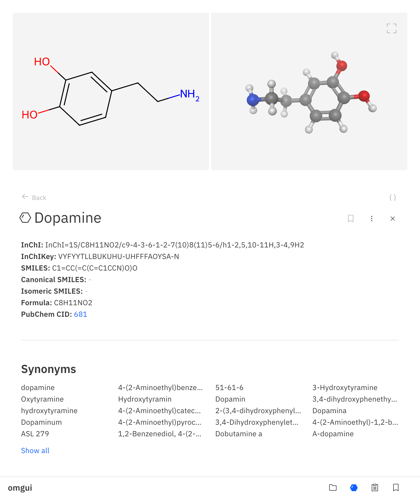

<!-- source ../agenv/bin/activate -->

<!-- python -m test -->

# OMGUI

_Open Modular Graphical User Interface_

OMGUI lets visualize small molecules, macromolecules and various types of data on the fly.

```python
import omgui

omgui.show_molset(["C(C(=O)O)N", "C1=CC=CC=C1", "CC(CC(=O)O)O"])
```


```python
omgui.show_mol('dopamine')
```



<br>

### Install

> [!NOTE]  
> _Optional: create virtual environment_
>
> ```shell
> python -m venv .venv
> ```
>
> ```shell
> source .venv/bin/activate
> ```

```shell
pip install -r requirements.txt
```

```shell
yes | plotly_get_chrome
```

```
uvicorn 'app.main:app' --host=0.0.0.0 --port=8034 --reload  --no-access-log
```

### Deploy

To deploy this app, use the [Dockerfile](Dockerfile), as it installs some system requirements for the Plotly PNG/SVG output to work.
