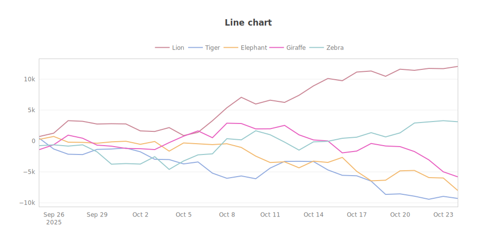
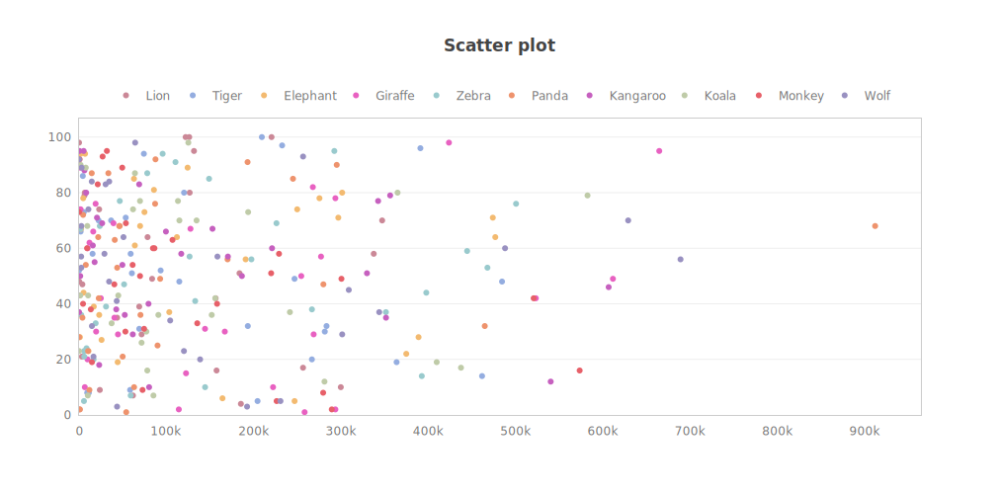

<sub>[home](../README.md) / [docs](readme.md) / chartviz.md</sub>

<!-- <sub>[&larr; BACK](readme.md)</sub> -->

# OMGUI - `chartviz` - Data Visualization


The `chartviz` sub-module lets you visualize various types of data charts on the fly, either as HTML page, SVG or PNG.

Supported chart types: **bar**, **line**, **pie** and **bubble** charts, **scatter plots**, **box plots** and **histograms**. See [examples](#examples) below.

> [!IMPORTANT]
> The chartviz & [molviz](molviz.md) sub-modules require additional dependencies:
>
> ```shell
> pip install git+https://github.com/themoenen/omgui.git@v0.1[viz]
> ```


<br>

## Visualizing Data

If you want to understand how to manually compose a chartviz url, jump to [Demo Interface](#demo-interface) below.

### Tl;dr

```python
from omgui import chartviz

chartviz.bar(data)
chartviz.line(data)
chartviz.scatterplot(data)
chartviz.bubble(data)
chartviz.pie(data)
chartviz.boxplot(data)
chartviz.histogram(data)
```

```python
from omgui import chartviz

bar_chart_data = [
  {
    "name": "Lion",
    "keys": [ "A", "B", "C" ],
    "values": [ 173, 493, 421 ]
  },
  {
    "name": "Tiger",
    "keys": [ "A", "B", "C" ],
    "values": [ 424, 320, 188 ]
  }
]

bar_chart_svg = chartviz.bar(bar_chart_data, output='svg')
bar_chart_png = chartviz.bar(bar_chart_data, output='png')
bar_chart_ops = chartviz.bar(bar_chart_data, output='svg', width=400, height=300)
```


<br>

### Data Structures

<!-- Bar chart -->
<details>
<summary>Bar chart</summary>

```
# Data structure for bar charts:

[
  {
    "name": "Lion",
    "keys": [ "A", "B", "C" ],
    "values": [ 173, 493, 421 ]
  },
  {
    "name": "Tiger",
    "keys": [ "A", "B", "C" ],
    "values": [ 424, 320, 188 ]
  }
]
```

</details>

<!-- Line chart -->
<details>
<summary>Line chart</summary>

```
# Data structure for line charts:

[
  {
    "name": "Lion",
    "x": [ "2025-10-02", "2025-10-03", "2025-10-04" ],
    "y": [ 104, 168, 219 ]
  },
  {
    "name": "Tiger",
    "x": [ "2025-10-02", "2025-10-03", "2025-10-04" ],
    "y": [ 135, 165, 369 ]
  }
]
```

</details>

<!-- Scatter plot -->
<details>
<summary>Scatter plot</summary>

```
# Data structure for scatter plots:

[
  {
    "name": "Monkey",
    "x": [ 186, 642, 480 ],
    "y": [ 185, 383, 100 ]
  },
  {
    "name": "Wolf",
    "x": [ 280, 194, 450 ],
    "y": [ 117, 522, 233 ]
  }
]
```

</details>

<!-- Bubble chart -->
<details>
<summary>Bubble chart</summary>

```
# Data structure for bubble charts:

[
  {
    "name": "Elephant",
    "x": [ 250, 714, 896 ],
    "y": [ 989, 338, 251 ],
    "size": [ 63, 10, 26 ]
  },
  {
    "name": "Zebra",
    "x": [ 175, 541, 864 ],
    "y": [ 103, 734, 247 ],
    "size": [ 36, 56, 14 ]
  }
]
```

</details>

<!-- Pie chart -->
<details>
<summary>Pie chart</summary>

```
# Data structure for pie charts:

[
  {
    "labels": [ "Lion", "Tiger", "Elephant" ],
    "values": [ 800, 200, 300 ],
  }
]
```

</details>

<!-- Boxplot -->
<details>
<summary>Boxplot</summary>

```
# Data structure for basic boxplots:

[
  {
    "name": "Lion",
    "data": [ 953, 146, 137 ]
  },
  {
    "name": "Tiger",
    "data": [ 672, 723, 629 ]
  }
]
```

```
# Data structure for grouped boxplots:
[
  {
    "name": "Tiger",
    "data": [ 376, 247, 986, 221 ],
    "groups": [ "A", "A", "B", "B" ]
  },
  {
    "name": "Elephant",
    "data": [ 678, 802, 576, 384 ],
    "groups": [ "A", "A", "B", "B" ]
  },
  {
    "name": "Giraffe",
    "data": [ 589, 137, 823, 472 ],
    "groups": [ "A", "A", "B", "B" ]
  }
]
```

</details>

<!-- Histograms -->
<details>
<summary>Histogram</summary>

```
# Data structure for histograms:

[
  {
    "name": "Lion",
    "values": [ 730, 679, 996 ]
  },
  {
    "name": "Tiger",
    "values": [ 162, 281, 771 ]
  }
]
```

</details>

<br>

### Available Parameters

```python
chartviz.bar(bar_chart_data, <param>=<val>, <param>=<val>)
```

| Parameter   | Type  | Default | Description                                                                                                                                                                                                    |
| :---------- | :---- | :------ | :------------------------------------------------------------------------------------------------------------------------------------------------------------------------------------------------------------- |
| output      | enum  | html    | Choose from `html`, `svg` or `png` to render an HTML page, a vector image or a bitmap image.<br>For image output, 'svg' is generally recommended.                                                              |
| title       | str   | None    | Title of the chart.                                                                                                                                                                                            |
| subtitle    | str   | None    | Subtitle of the chart.                                                                                                                                                                                         |
| body        | str   | None    | _[ HTML ONLY ]_ Paragraph displayed below the chart. Only used with output='html'.                                                                                                                             |
| x_title     | str   | None    | Title for the x-axis, eg. 'Date'                                                                                                                                                                               |
| y_title     | str   | None    | Title for the y-axis, eg. 'Spending'                                                                                                                                                                           |
| x_prefix    | str   | None    | Prefix for x-axis tick labels, eg. "€".                                                                                                                                                                        |
| y_prefix    | str   | None    | Prefix for y-axis tick labels, eg. "€".                                                                                                                                                                        |
| x_suffix    | str   | None    | Suffix for x-axis tick labels, eg. "%".                                                                                                                                                                        |
| y_suffix    | str   | None    | Suffix for y-axis tick labels, eg. "%".                                                                                                                                                                        |
| width       | int   | 1200    | Width of the chart in pixels.                                                                                                                                                                                  |
| height      | int   | 900     | Height of the chart in pixels.                                                                                                                                                                                 |
| scale       | float | 1       | _[ PNG ONLY ]_ Scaling factor for the png pixel output. Set to 2 for high-resolution displays. Only used when output='png'                                                                                     |
| omit_legend | bool  | False   | If True, do not display the legend.                                                                                                                                                                            |
| return_data | bool  | False   | _[ NOTEBOOKS ONLY ]_ Whether to return raw data (True) or display the svg/png (False) in Jupyter Notebook. Only used when output='svg/png'.<br>See [Jupyter Notebook](#jupyter-notebook) below for an example. |

<br>

### Direct Rendering

You don't need to use the `chartviz` library to generate a visualization URL.  
You can simply launch the server and compose your own URLs: `/viz/chart/<chart_type>?data=<your_data>`

```python
import omgui

omgui.launch()
```

```text
http://localhost:8024/viz/chart/bar?data=%5B%7B%22keys%22%3A%5B%22A%22%2C%22B%22%2C%22C%22%5D%2C%22values%22%3A%5B73%2C93%2C21%5D%2C%22name%22%3A%22Lion%22%7D%2C%7B%22keys%22%3A%5B%22A%22%2C%22B%22%2C%22C%22%5D%2C%22values%22%3A%5B24%2C20%2C88%5D%2C%22name%22%3A%22Tiger%22%7D%5D&width=400&height=300&output=svg
```

<br>

## Demo Interface

Use the demo interface to see what options are available, how to compose your URL and how to structure your data for each type of chart.

http://localhost:8024/viz/chart


<br>

## Deployment

Because the chart visualization depends on some system requirements for the PNG/SVG output to work, it's recommended to deploy it using Docker or Podman, as the [Dockerfile](Dockerfile) takes care of installing these dependencies. See `apt-get` and `plotly_get_chrome`.

<br>

## Examples






<!--
```python
from omgui import chartviz

groups = ["Group A", "Group B", "Group C"]
data = [
    {
        "keys": groups,
        "name": "Flamingo",
        "data": [ 56, 79, 10 ]
    },
    {
        "keys": groups,
        "name": "Possum",
        "data": [ 81, 10, 50 ]
    },
    {
        "keys": groups,
        "name": "Shrew",
        "data": [ 99, 20, 45 ]
    }
]

chartviz.boxplot(data)
```
-->
