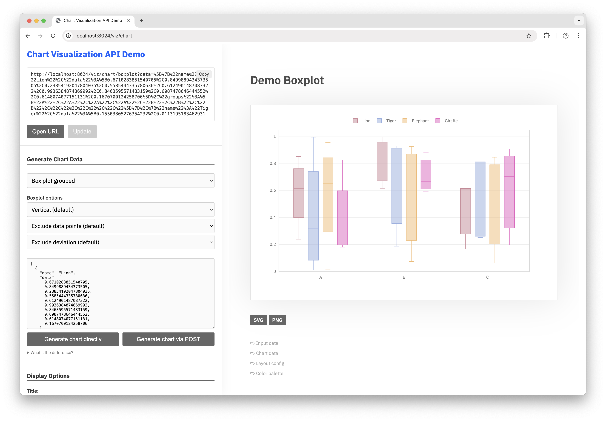

<sub>[&larr; BACK](readme.md)</sub>

# OMGUI - `chartviz` - Data Visualization


The `chartviz` sub-module lets you visualize various types of data charts on the fly, either as HTML page, SVG or PNG.

Supported chart types: **bar**, **line**, **pie** and **bubble** charts, **scatter plots**, **box plots** and **histograms**. See [examples](#examples) below.

> [!IMPORTANT]
> The chartviz & [molviz](molviz.md) sub-modules require additional dependencies:
>
> ```shell
> pip install git+https://github.com/themoenen/omgui.git@v0.1[viz]
> ```


<br>

## Visualizing Data

If you want to understand how to manually compose a chartviz url, jump to [Demo Interface](#demo-interface) below.

### Tl;dr

```python
from omgui import chartviz

bar_chart_data = [
  {
    "keys": [ "A", "B", "C" ],
    "values": [ 73, 93, 21 ],
    "name": "Lion"
  },
  {
    "keys": [ "A", "B", "C" ],
    "values": [ 24, 20, 88 ],
    "name": "Tiger"
  },
]

bar_chart_svg = chartviz.bar(bar_chart_data)
bar_chart_png = chartviz.bar(bar_chart_data, png=True)
bar_chart_small = chartviz.bar(bar_chart_data, png=True, width=400, height=300)
```


<br>

### Charts Types

<details>
<summary>Bar chart</summary>

```
# Data structure for bar charts
# ---

[
  {
    "keys": [ "A", "B", "C" ],
    "values": [ 73, 93, 21 ],
    "name": "Lion"
  },
  {
    "keys": [ "A", "B", "C" ],
    "values": [ 24, 20, 88 ],
    "name": "Tiger"
  },
]
```

</details>

<br>

### Available Parameters

```python
chartviz.bar(bar_chart_data, <param>=<val>, <param>=<val>)
```

| Parameter   | Type  | Default | Description                                                                                                                                       |
| :---------- | :---- | :------ | :------------------------------------------------------------------------------------------------------------------------------------------------ |
| title       | str   | None    | Title of the chart.                                                                                                                               |
| subtitle    | str   | None    | Sub-title of the chart.                                                                                                                           |
| body        | str   | None    | [ HTML ONLY ] Text paragraph to be displayed above the chart.                                                                                     |
| x_title     | str   | None    | Label for the X axis, eg. 'Date'                                                                                                                  |
| y_title     | str   | None    | Label for the Y axis, eg. 'Spending'                                                                                                              |
| x_prefix    | str   | None    | Prefix to be added to the values on the X axis, eg. '€'                                                                                           |
| y_prefix    | str   | None    | Prefix to be added to the values on the Y axis, eg. '€'                                                                                           |
| x_suffix    | str   | None    | Suffix to be added to the values on the X axis, eg. 'kg'                                                                                          |
| y_suffix    | str   | None    | Suffix to be added to the values on the Y axis, eg. 'kg'                                                                                          |
| width       | int   | 1200    | Width of the chart in pixels.                                                                                                                     |
| height      | int   | 900     | Height of the chart in pixels.                                                                                                                    |
| output      | enum  | html    | Choose from `html`, `svg` or `png` to render an HTML page, a vector image or a bitmap image.<br>For image output, 'svg' is generally recommended. |
| scale       | float | None    | [ PNG ONLY ] Scaling factor for the png pixel output. Set to 2 for high-resolution displays.                                                      |
| omit_legend | bool  | None    | Renders the chart without the legend when True.                                                                                                   |

<br>

### Direct Rendering

You don't need to use the `chartviz` library to generate a visualization URL.  
You can simply launch the server and compose your own URLs: `/viz/chart/<chart_type>?data=<your_data>`

```python
import omgui

omgui.launch()
```

```text
http://localhost:8024/viz/chart/bar?data=%5B%7B%22keys%22%3A%5B%22A%22%2C%22B%22%2C%22C%22%5D%2C%22values%22%3A%5B73%2C93%2C21%5D%2C%22name%22%3A%22Lion%22%7D%2C%7B%22keys%22%3A%5B%22A%22%2C%22B%22%2C%22C%22%5D%2C%22values%22%3A%5B24%2C20%2C88%5D%2C%22name%22%3A%22Tiger%22%7D%5D&width=400&height=300&output=svg
```

<br>

## Demo Interface

Use the demo interface to see what options are available, how to compose your URL and how to structure your data for each type of chart.

http://localhost:8024/viz/chart



<br>

## Deployment

Because the chart visualization depends on some system requirements for the PNG/SVG output to work, it's recommended to deploy it using Docker or Podman, as the [Dockerfile](Dockerfile) takes care of installing these dependencies. See `apt-get` and `plotly_get_chrome`.

<br>

## Examples


<!--
```python
from omgui import chartviz

groups = ["Group A", "Group B", "Group C"]
data = [
    {
        "keys": groups,
        "name": "Flamingo",
        "data": [ 56, 79, 10 ]
    },
    {
        "keys": groups,
        "name": "Possum",
        "data": [ 81, 10, 50 ]
    },
    {
        "keys": groups,
        "name": "Shrew",
        "data": [ 99, 20, 45 ]
    }
]

chartviz.boxplot(data)
```
-->
