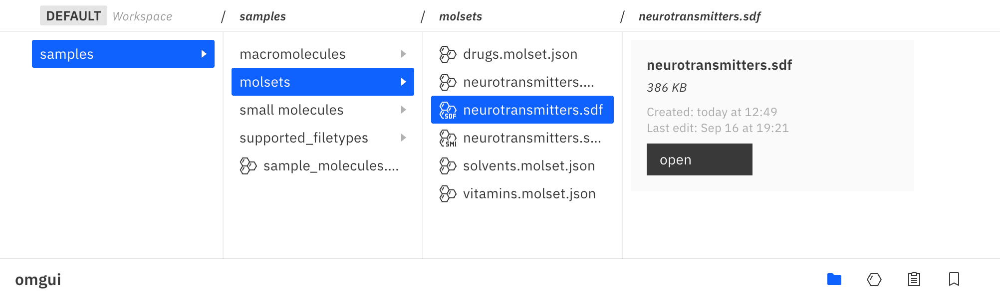

# OMGUI - GUI<!-- omit in toc -->

The GUI provides a visual window onto your molecular data, helping you with evaluation and triage.

#### How it works<!-- omit in toc -->

It can be launched from any **Python** script (in the browser) or from a **Jupyter Notebook** (in an iframe).  
Any function that requires the GUI will start the server, which will then keep on running until the application or Notebook is shut down.

If you wish to start the server in the background, you can run:

```
omgui.launch()
```

### Components<!-- omit in toc -->

- [1. File Browser](#1-file-browser)
  - [Supported File Formats](#supported-file-formats)
- [2. Molecule Viewer](#2-molecule-viewer)
- [3. Molset Viewer](#3-molset-viewer)
- [4. Data Viewer](#4-data-viewer)
- [5. Molecule Working Set](#5-molecule-working-set)
- [6. Results](#6-results)

<br>

## 1. File Browser

The file browser lets your browse the files in your workspace. It lets you open molecule files directly into the molecule viewer.

Files can easily be opened in their default system app, which is also the default for any unsupported file formats.

```python
import omgui

omgui.show_files()
omgui.open_file('my_candidates/batch_1.sdf')
```

<kbd></kbd>

### Supported File Formats

| Filetype   | Suffix            | Content        | Description                                                                                                                                                                          |
| :--------- | :---------------- | :------------- | :----------------------------------------------------------------------------------------------------------------------------------------------------------------------------------- |
| OMGUI_JSON | .smol.json        | Small molecule | OMGUI's JSON schema for individual small molecules, can be exported to SDF or CSV format                                                                                             |
| OMGUI_JSON | .mmol.json        | Macromolecule  | OMGUI's JSON schema for individual macromolecules, can be exported to CIF, PDB or CSV format                                                                                         |
| OMGUI_JSON | .molset.json      | Molecule set   | OMGUI's JSON schema for a set of small molecules.<br>Sets of macromolecules are not supported at this time.                                                                          |
|            |                   |                |                                                                                                                                                                                      |
| MDL        | .mol              | Small molecule | Small molecule file holding information about the atoms, bonds, connectivity and coordinates of a molecule - [learn more](https://en.wikipedia.org/wiki/Chemical_table_file#Molfile) |
| SDF        | .sdf              | Molecule set   | Multi-molecule version of an MDL file - [learn more](https://en.wikipedia.org/wiki/Chemical_table_file#SDF)                                                                          |
| SMI        | .smi              | Molecule set   | A basic text file with a SMILES string per line                                                                                                                                      |
| CIF        | .cif              | Macromolecule  | Stands for "Crystallographic Information File" and is intended as a successor to the PDB format - [learn more](https://en.wikipedia.org/wiki/Crystallographic_Information_File)      |
| PDB        | .pdb              | Macromolecule  | Stands for "Protein Data Bank" and described the three-dimensional structures of molecules - [learn more](<https://en.wikipedia.org/wiki/Protein_Data_Bank_(file_format)>)           |
| JSON       | .json             | Data           | Open standard data serialization format [learn more](https://en.wikipedia.org/wiki/JSON)                                                                                             |
| YAML       | .yml              | Data           | Human-readable data serialization format - [learn more](https://simple.wikipedia.org/wiki/YAML)                                                                                      |
| TEXT       | .text             | Text           | Basic text format                                                                                                                                                                    |
| CSV        | .csv              | Data           | `COMING SOON` Comma-separated text data format - [learn more](https://en.wikipedia.org/wiki/Comma-separated_values)                                                                  |
| PDF        | .pdf              | Rich document  | `COMING SOON` Standard documents including text formatting and images - [learn more](https://en.wikipedia.org/wiki/PDF)                                                              |
| SVG        | .svg              | Vector image   | `COMING SOON` XML-based vector graphics format for defining two-dimensional graphics - [learn more](https://en.wikipedia.org/wiki/SVG)                                               |
| IMG        | .png/jpg/gif/webp | Bitmap image   | `COMING SOON` Various standard web image formats                                                                                                                                     |

<br>

## 2. Molecule Viewer

The molecule viewer gives you an at-a-glance overview of all available information on a particular molecule, as well as a 2D and interactive 3D visualization.

New molecules are by default prepopulated with data from RDKit and (when available) PubChem, while custom properties can be added via the [molecule working set](#5-molecule-working-set).

```python
import omgui

omgui.show_mol("dopamine")
omgui.show_mol("C1=CC(=C(C=C1CCN)O)O") # SMILES
omgui.show_mol("InChI=1S/C8H11NO2/c9-4-3-6-1-2-7(10)8(11)5-6/h1-2,5,10-11H,3-4,9H2") # InChI
omgui.show_mol("VYFYYTLLBUKUHU-UHFFFAOYSA-N") # InChIKey - only when available on PubChem
omgui.show_mol(681) # PubChem CID - only when available on PubChem
omgui.open_file('dopamine.smol.json') # Molecule file formats - only when available on PubChem
```

<kbd></kbd>

<br>

## 3. Molset Viewer

The molset viewer lets you view, sort and triage a paginated set of molecules.

In the future you can expect more advanced functionality like filtering, subsetting, merging and data visualizations.

```python
import omgui

omgui.show_mols(["C(C(=O)O)N", "C1=CC=CC=C1", "CC(CC(=O)O)O"])
omgui.show_file("neurotransmitters.molset.json")
omgui.show_file("neurotransmitters.sdf")
omgui.show_file("neurotransmitters.smi")
omgui.show_file("neurotransmitters.csv") # Support coming soon
```

<kbd></kbd>

<br>

## 4. Data Viewer

> [!IMPORTANT]  
> Not yet implemented, coming soon.

The data viewer will let you easily view an edit data from a CSV or YAML file. This includes editing values as well as adding, removing and renaming rows or columns.

<br>

## 5. Molecule Working Set

Your molecules working set (or "MWS") functions as a basket for storing selected candidate molecules for further processing.

Each workspace has their own MWS. The MWS lets you easily fetch your molecules as a list of SMILES to be processed by your software, model or function of choice, and then lets you update your molecules with the newly calculated properties.

> [!IMPORTANT]  
> Partly implemented.

```python
from omgui import mws

# Add some molecules and inspect them in the GUI
mws.add("C(C(=O)O)N")
mws.add("C1=CC=CC=C1")
mws.open()
```

```python
# Get a list of your molecules as SMILES
my_candidates = mws.get_smiles()

# Perform any type of property calculation
my_calculated_prop_result = [
    { "foo": 0.729 },
    { "foo": 1.235 }
]

# Update the molecules in your working set
mws.add_props(my_calculated_prop_result) # To be inmplemented

# Export your results as SDF file
mws.export(format="sdf")
```

```python
# Clear your working set to start over
mws.clear()
```

<kbd></kbd>

<br>

## 6. Results

> [!IMPORTANT]  
> Not yet implemented, coming soon.

Your results page will hold a history of result sets that were saved.

```python
import omgui.results

results.add(["C(C(=O)O)N", "C1=CC=CC=C1"]) # To be inmplemented
results.show() # To be inmplemented
```
