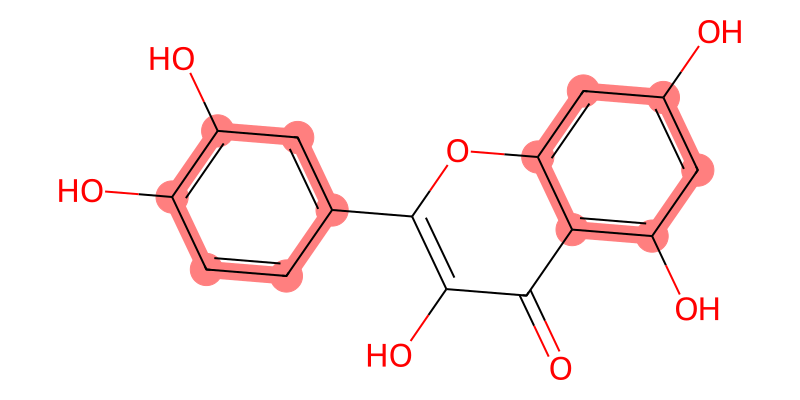

<sub>[&larr; BACK](readme.md)</sub>

# OMGUI - `molviz` - Molecule Visualization


The `molviz` sub-module lets you visualize molecules on the fly, in 2D and 3D, either as SVG or PNG.

Note that the [chart](chartviz) & molecule visualization requires additional dependencies:

```shell
pip install git+https://github.com/themoenen/omgui.git@v0.1[viz]
```



<br>

## Instructions

In order to use the molecule visualization, simply start the server in the background, then compose your url:

`/viz/mol/<SMILES>&output=<svg/png>`

```python
import omgui

omgui.launch()
```

```text
http://localhost:8024/viz/mol/C1=CC(=C(C=C1C2=C(C(=O)C3=C(C=C(C=C3O2)O)O)O)O)O?highlight=c1ccccc1&width=800&height=400
```

### Demo Interface

Use the demo interface to see what options are available and how to compose your URL.

http://localhost:8024/viz/mol


<br>

## Deployment

Because the chart visualization depends on some system requirements for the PNG/SVG output to work, it's recommended to deploy it using Docker or Podman, as the [Dockerfile](Dockerfile) takes care of installing these dependencies. See `apt-get` and `plotly_get_chrome`.

<br>

## Examples


