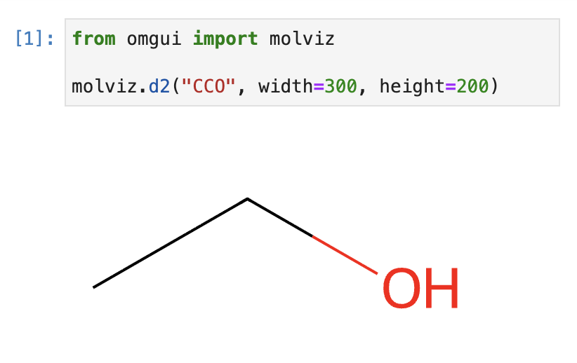
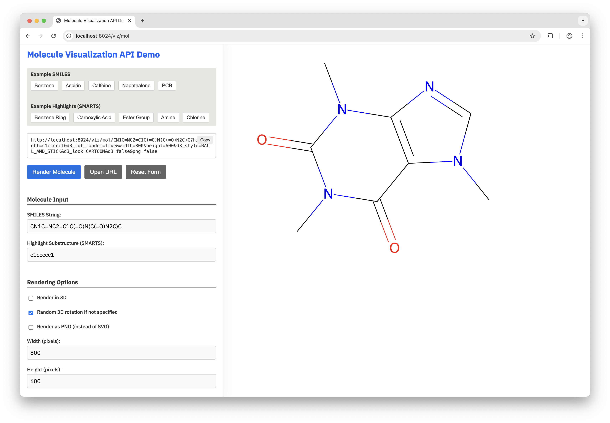
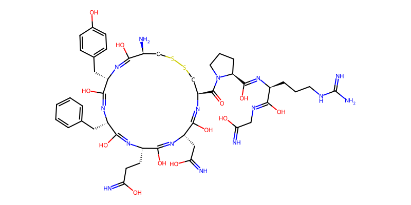
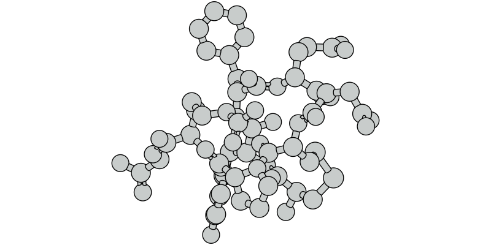
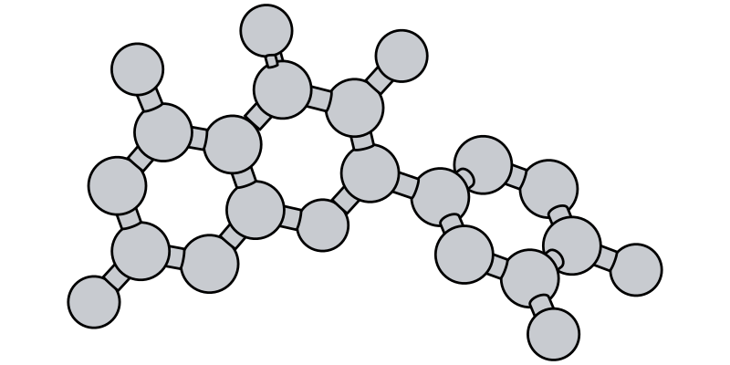
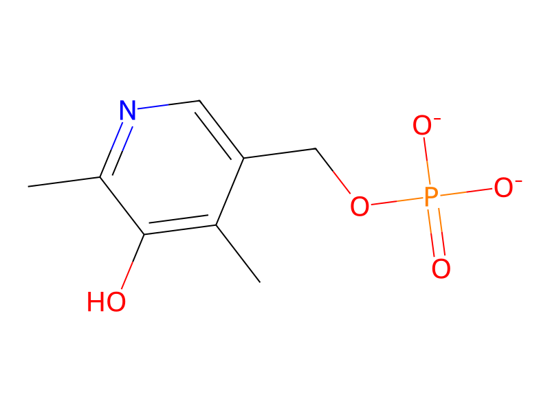
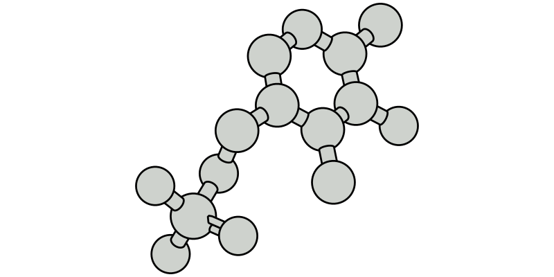

<sub>[&larr; BACK](readme.md)</sub>

# OMGUI - `molviz` - Molecule Visualization


The `molviz` sub-module lets you visualize molecules on the fly, in 2D and 3D, either as SVG or PNG.

> [!IMPORTANT]
> The [chart](chartviz) & molecule visualization requires additional dependencies:
>
> ```shell
> pip install git+https://github.com/themoenen/omgui.git@v0.1[viz]
> ```


<br>

## The Basics

In order to use the molecule visualization, simply start the server in the background, then compose your url: `/viz/mol/<SMILES>`

```python
import omgui

omgui.launch()
```

```text
http://localhost:8024/viz/mol/CCO
```

<!-- ```text
http://localhost:8024/viz/mol/C1=CC(=C(C=C1C2=C(C(=O)C3=C(C=C(C=C3O2)O)O)O)O)O?highlight=c1ccccc1&width=800&height=400
``` -->

<br>

## Visualizing Molecules

If you want to understand how to manually compose a molviz url, jump to [Demo Interface](#demo-interface) below.

### Tl;dr

```python
from omgui import molviz

url_2d = molviz.d2("CCO", highlight="CO", url=True)
url_3d = molviz.d3("CCO", highlight="CO", url=True)

svg_2d = molviz.d2("CCO", highlight="CO")
png_2d = molviz.d2("CCO", highlight="CO", png=True)

svg_3d = molviz.d3("CCO", width=300, height=200)
svg_3d_fixed = molviz.d3("CCO", width=300, height=200, d3_rot_random=False, d3_rot_x=1, d3_rot_y=1.5, d3_rot_z=2)

```

<br>

### Available Parameters

```python
molviz.d2("<SMILES>", <param>=<val>, <param>=<val>)
```

| Parameter     | Type | Default        | Description                                                                                                                                              |
| :------------ | ---- | :------------- | :------------------------------------------------------------------------------------------------------------------------------------------------------- |
| highlight     | str  | None           | A SMARTS substructure.                                                                                                                                   |
| width         | int  | 600            | Image width in pixels.                                                                                                                                   |
| height        | int  | 450            | Image height in pixels.                                                                                                                                  |
| png           | bool | False          | Returns a PNG image instead of an SVG, when `url` is False.                                                                                              |
| url           | bool | False          | Return a URL string instead of the image.                                                                                                                |
| data          | bool | False          | Jupyter Notebook only: return image data instead of displaying it, when url is False.<br>See [Jupyter Notebook](#jupyter-notebook) below for an example. |
|               |      |                |                                                                                                                                                          |
| d3_style      | enum | BALL_AND_STICK | Choose from `BALL_AND_STICK`, `SPACEFILLING`, `TUBE` or `WIREFRAME`                                                                                      |
| d3_look       | enum | CARTOON        | Choose from `CARTOON` or `GLOSSY`                                                                                                                        |
| d3_rot_random | bool | True           | Whether the 3D molecule should be randomly rotated.                                                                                                      |
| d3_rot_x      | int  | None           | Custom rotation where `1` equals 60°, so 6 would mean a 360° rotation.                                                                                   |
| d3_rot_y      | int  | None           | Custom rotation where `1` equals 60°, so 6 would mean a 360° rotation.                                                                                   |
| d3_rot_z      | int  | None           | Custom rotation where `1` equals 60°, so 6 would mean a 360° rotation.                                                                                   |

<br>

### Jupyter Notebook

When used in a Jupyter Notebook, molecules will be visualized inline.

<kbd></kbd>

If you want to capture the image data instead, you can set the `data` parameter to True.  
This way you can store the image data for later display.

```python
from omgui import molviz
from IPython.display import Image, SVG, display

svg_data = molviz.d2("CCO", data=True)
png_data = molviz.d2("CCO", data=True, png=True)

display(SVG(svg_data))
display(Image(png_data))
```

<br>

## Demo Interface

Use the demo interface to see what options are available and how to compose your URL.

http://localhost:8024/viz/mol



<br>

## Deployment

Because the chart visualization depends on some system requirements for the PNG/SVG output to work, it's recommended to deploy it using Docker or Podman, as the [Dockerfile](Dockerfile) takes care of installing these dependencies. See `apt-get` and `plotly_get_chrome`.

<br>

## Examples







